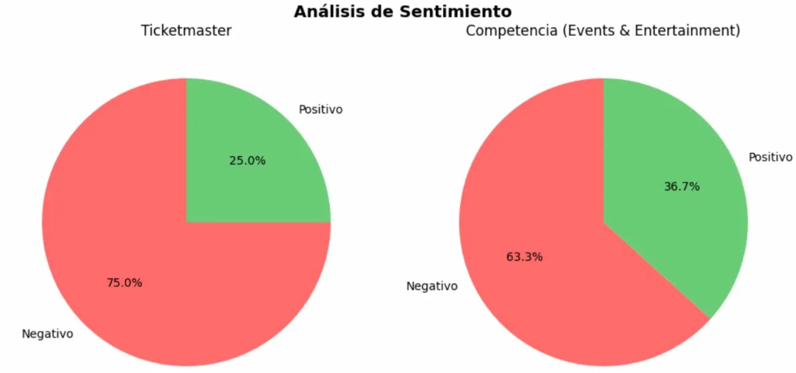
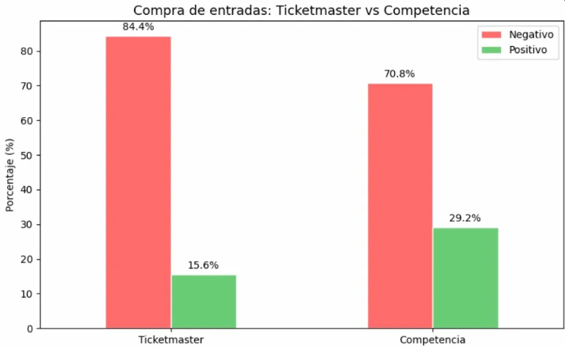

# 🎟️ Proyecto Deep Learning - Ticketmaster NLP Analysis

Análisis de reseñas de Trustpilot de **Ticketmaster** (sector: Events & Entertainment) mediante técnicas de NLP y Deep Learning.

## 🎯 Objetivo

Analizar el sentimiento y los topics de las reseñas de Ticketmaster y compararlos con los de su competencia en el mismo sector.

## 📊 Resultados principales

- **75%** de reseñas negativas en Ticketmaster vs **63.3%** de la competencia
- Ticketmaster está **11.7 puntos porcentuales** por encima del sector en negatividad
- Dos topics principales identificados:
  - **Experiencia en el evento** → 64.4% negativo
  - **Compra de tickets y app** → 84.4% negativo ⚠️ principal área de mejora
- El proceso de compra es **14 puntos peor** que la media del sector (84.4% vs 70.8%)

### Sentimiento global: Ticketmaster vs Competencia


### Comparativa directa en compra de entradas



## 📁 Estructura del proyecto

```
ticketmaster-nlp-analysis/
│
├── analisis_ticketmaster.ipynb        # Notebook principal
│
└── data/
    ├── trustpilot-reviews-123k.csv            # Dataset completo original
    ├── ticketmaster_reviews.csv               # Reseñas de Ticketmaster
    └── events_entertainment_reviews.csv       # Reseñas del Sector (sin Ticketmaster)
```

## 🔄 Flujo del análisis

1. Extracción y separación de datos
2. Limpieza de texto
3. Análisis de sentimiento (DistilBERT)
4. Topic modeling (BERTopic)
5. Sentimiento por topic
6. Comparativa Ticketmaster vs competencia
7. Conclusiones

## 🛠️ Tecnologías

- Python 3.12
- pandas, numpy
- transformers (DistilBERT)
- BERTopic, sentence-transformers
- scikit-learn
- matplotlib, seaborn, wordcloud

## 📝 Dataset

- **Fuente:** Trustpilot reviews
- **Total:** 123.181 reseñas · 1.680 empresas · 22 sectores
- **Empresa analizada:** www.ticketmaster.co.uk (100 reseñas)
- **Competencia:** 5.198 reseñas del sector Events & Entertainment

---
*Proyecto desarrollado durante el Máster en Data Science & IA, en el módulo de Deep Learning — Evolve*